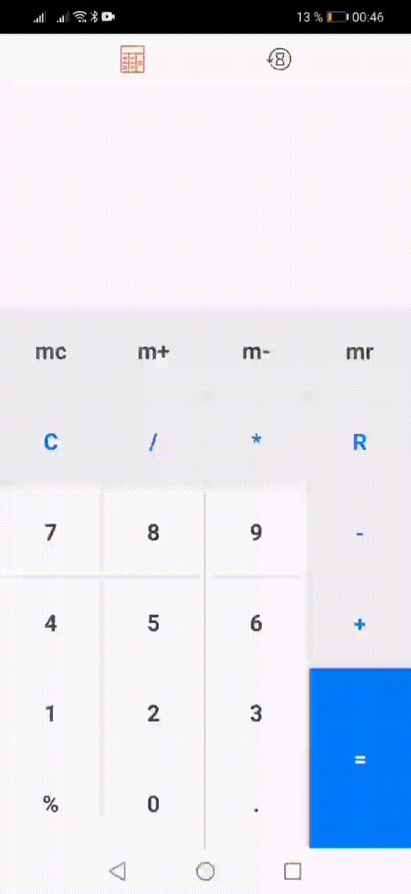
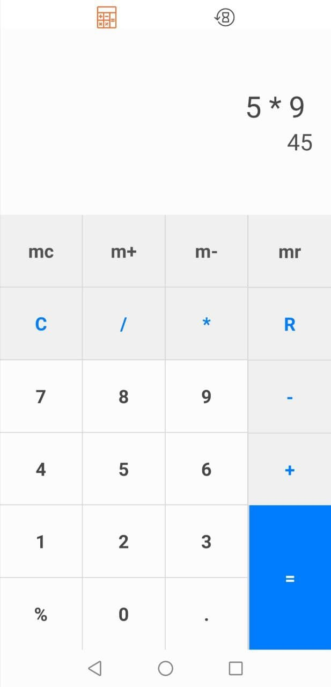
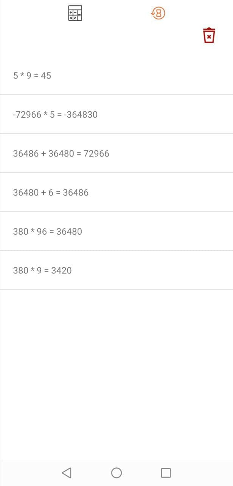

# Simple Calculator

A simple app to help you with complex calculations.

## Do any calculations you want

## Check your previous calculation in history and revert to them if you want

 

## Technology stack
- Kotlin
- Single Activity
- MVVM
- Dagger 2
- Room
- ViewModel + LiveData
- Coroutines
- Custom View
- Recycler with custom Adapter
- Swipe
- Shared Preferences
- AAC
- Jetpack Navigation
- Timber
- Chain responsibility design pattern
- Facade design pattern

## License
Copyright (C) 2021 Nikolay Volchkov nikolay.dev30@gmail.com